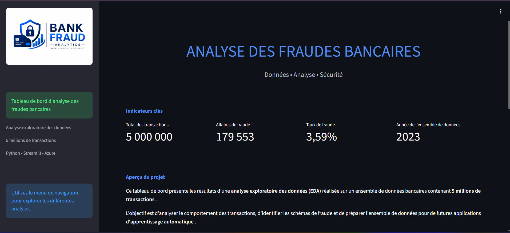
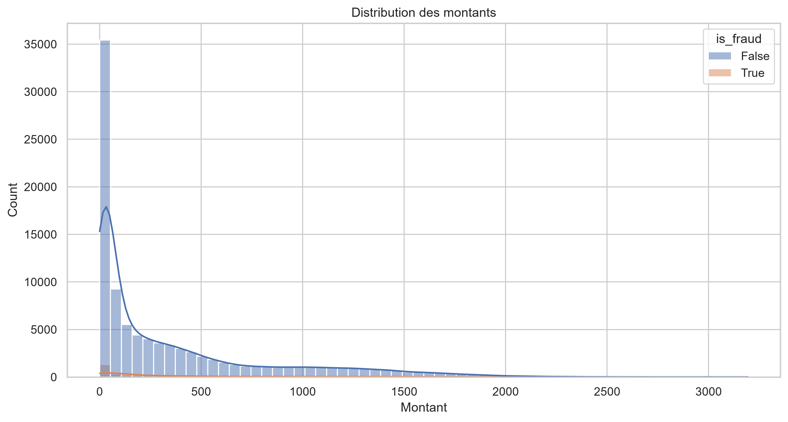
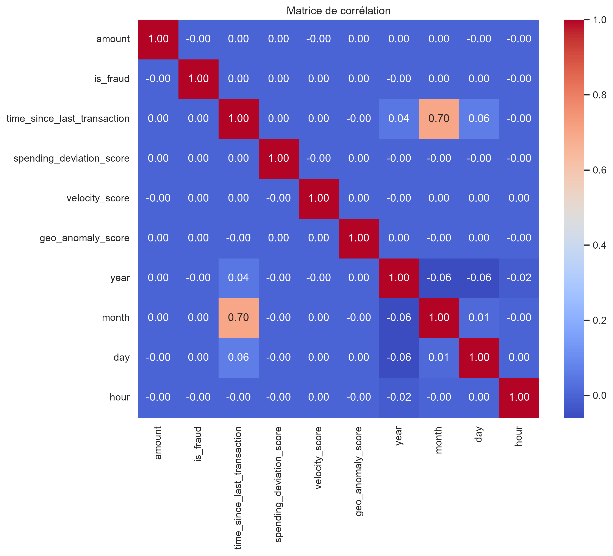

# 🛡️ Bank Fraud Analytics Dashboard

> Dashboard interactif d'analyse exploratoire des fraudes bancaires développé avec **Python**, **Streamlit** et **Microsoft Azure**.

# 🛡️ Bank Fraud Analytics Dashboard

> Dashboard interactif d'analyse exploratoire des fraudes bancaires développé avec **Python**, **Streamlit** et **Microsoft Azure**.


[](https://bank-fraud-dashboard-c4esada6b0f0fkdp.francecentral-01.azurewebsites.net/)
[](https://github.com/adys-s/bank-fraud-analytics-dashboard)

---

# 📖 Présentation

Ce projet présente une **Analyse Exploratoire des Données (EDA)** réalisée sur un jeu de données contenant :

- 5 000 000 transactions
- 179 553 transactions frauduleuses
- un taux de fraude de 3,59 %

L'objectif est d'explorer les données, d'identifier les comportements frauduleux et de mettre en évidence les principaux indicateurs de fraude à travers un **dashboard interactif**.

Le projet couvre l'ensemble du cycle de développement, depuis l'analyse des données jusqu'au déploiement de l'application sur **Microsoft Azure**.

---

# 🎯 Objectifs du projet

- Explorer les transactions bancaires
- Comprendre les comportements frauduleux
- Réaliser des visualisations pertinentes
- Préparer les données pour le Machine Learning
- Développer un dashboard interactif
- Déployer une application web sur Microsoft Azure

---

# 📊 Analyses réalisées

Le dashboard est composé des pages suivantes :

- 🏠 Accueil
- 💰 Analyse des montants des transactions
- 💳 Analyse des types de transactions
- 🛍 Analyse des catégories de commerçants
- 🌍 Analyse des localisations
- 💳 Analyse des moyens de paiement
- 📱 Analyse des appareils utilisés
- ⚡ Analyse du Velocity Score
- 📈 Matrice de corrélation
- ✅ Conclusion

---

# 🚀 Réalisations du projet

Au cours de ce projet, les étapes suivantes ont été réalisées :

## 📌 1. Analyse exploratoire des données (EDA)

L'ensemble de l'analyse exploratoire a été réalisé dans un notebook Jupyter avant le développement du dashboard interactif.

- Exploration du jeu de données
- Analyse statistique
- Étude de la variable cible
- Recherche des indicateurs de fraude
- Interprétation des résultats

---

## 📌 2. Création des visualisations

Création de graphiques avec **Matplotlib** afin d'analyser :

- le montant des transactions
- le type de transaction
- les catégories de commerçants
- les localisations
- les moyens de paiement
- les appareils utilisés
- le Velocity Score
- les corrélations entre variables

---

## 📌 3. Développement du Dashboard

Développement d'une application interactive avec **Streamlit** comprenant :

- une page d'accueil
- plusieurs pages d'analyse
- une navigation multipage
- une interface responsive
- une architecture modulaire

---

## 📌 4. Gestion du projet

Le projet a été organisé selon les bonnes pratiques de développement :

- architecture modulaire
- séparation du code
- fonctions réutilisables
- gestion des dépendances
- commentaires du code

---

## 📌 5. Versionnement

Le projet a été versionné avec :

- Git
- GitHub

---

## 📌 6. Intégration Continue (CI/CD)

Le déploiement est automatisé grâce à :

- GitHub Actions

À chaque mise à jour du dépôt GitHub, l'application est automatiquement redéployée.

---

## 📌 7. Déploiement Cloud

L'application est déployée sur :

- Microsoft Azure App Service

Le projet est donc accessible directement depuis un navigateur.

---

# 🛠 Technologies utilisées

## Langages

- Python

## Analyse de données

- Pandas
- NumPy

## Visualisation

- Matplotlib
- Seaborn

## Développement Web

- Streamlit

## Cloud

- Microsoft Azure App Service

## Versionnement

- Git
- GitHub

## CI/CD

- GitHub Actions

---

# 🏗 Architecture du projet

```text
bank-fraud-analytics-dashboard/
│
├── assets/
│   └── logo.png
│
├── data/
│   └── financial_fraud_detection_dataset.csv
│
├── images/
│
├── notebooks/
│   └── EDA_Financial_Fraud.ipynb
│
├── pages/
│   ├── 1_Transaction_Amount.py
│   ├── 2_Transaction_Type.py
│   ├── 3_Merchant_Category.py
│   ├── 4_Location.py
│   ├── 5_Payment_Channel.py
│   ├── 6_Device_Used.py
│   ├── 7_Velocity_Score.py
│   ├── 8_Correlation.py
│   └── 9_Conclusion.py
│
├── reports/
│   └── EDA_Financial_Fraud.html
│
├── app.py
├── utils.py
├── requirements.txt
└── README.md
```

---

# 📸 Aperçu du projet

## 🏠 Accueil

La page d'accueil présente les indicateurs clés du projet et les objectifs de l'analyse.




---

## 💰 Analyse des montants

Cette visualisation illustre la distribution des montants des transactions bancaires au sein du jeu de données.



---

## 📈 Matrice de corrélation

Cette visualisation met en évidence les relations entre les différentes variables du jeu de données.



---

# ▶️ Exécuter le projet localement

## Cloner le dépôt

```bash
git clone https://github.com/adys-s/bank-fraud-analytics-dashboard.git
```

## Accéder au projet

```bash
cd bank-fraud-analytics-dashboard
```

## Installer les dépendances

```bash
pip install -r requirements.txt
```

## Lancer l'application

```bash
streamlit run app.py
```

---

# 🌐 Démonstration

L'application est déployée sur **Microsoft Azure App Service**.

🔗 **Accéder au dashboard :**

🔗 [Bank Fraud Analytics Dashboard](https://bank-fraud-dashboard-c4esada6b0f0fkdp.francecentral-01.azurewebsites.net/)

---

# 💼 Compétences développées

À travers ce projet, les compétences suivantes ont été mobilisées :

### Data Analytics

- Analyse exploratoire des données
- Analyse statistique
- Visualisation de données
- Interprétation des résultats

### Développement

- Python
- Streamlit
- Architecture modulaire
- Réutilisation de fonctions

### Data Engineering

- Gestion de projet
- Git
- GitHub
- Gestion des dépendances

### Cloud Computing

- Microsoft Azure
- Azure App Service
- Déploiement d'application web

### DevOps

- GitHub Actions
- Déploiement continu (CI/CD)

---

# 🎯 Résultat

Ce projet a permis de :

- réaliser une analyse exploratoire complète sur un jeu de données de fraude bancaire ;
- développer une application web interactive avec Streamlit ;
- organiser le projet selon les bonnes pratiques de développement ;
- versionner le code avec Git et GitHub ;
- automatiser le déploiement avec GitHub Actions ;
- déployer l'application sur Microsoft Azure.

Le projet est désormais entièrement fonctionnel et accessible en ligne.

---

# 👨‍💻 Auteur

**Yawa Silvère ADODO-DAHOUE**


GitHub :
https://github.com/adys-s

---

⭐ Si ce projet vous a intéressé, n'hésitez pas à le consulter, à laisser une étoile sur GitHub ou à me contacter pour échanger autour de la Data, du Cloud et du Machine Learning.
